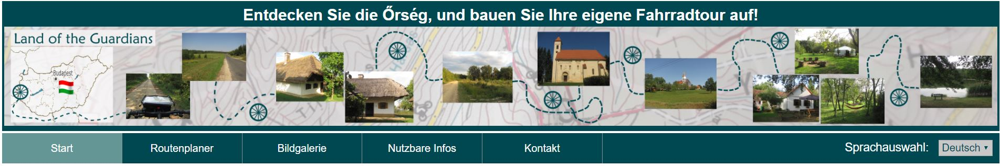
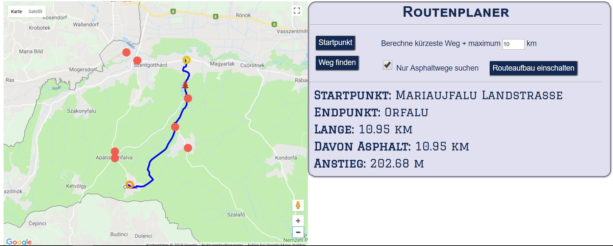
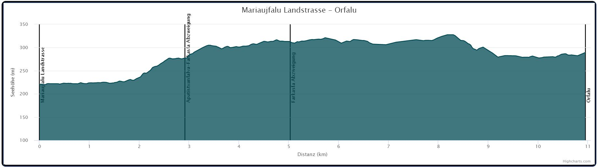
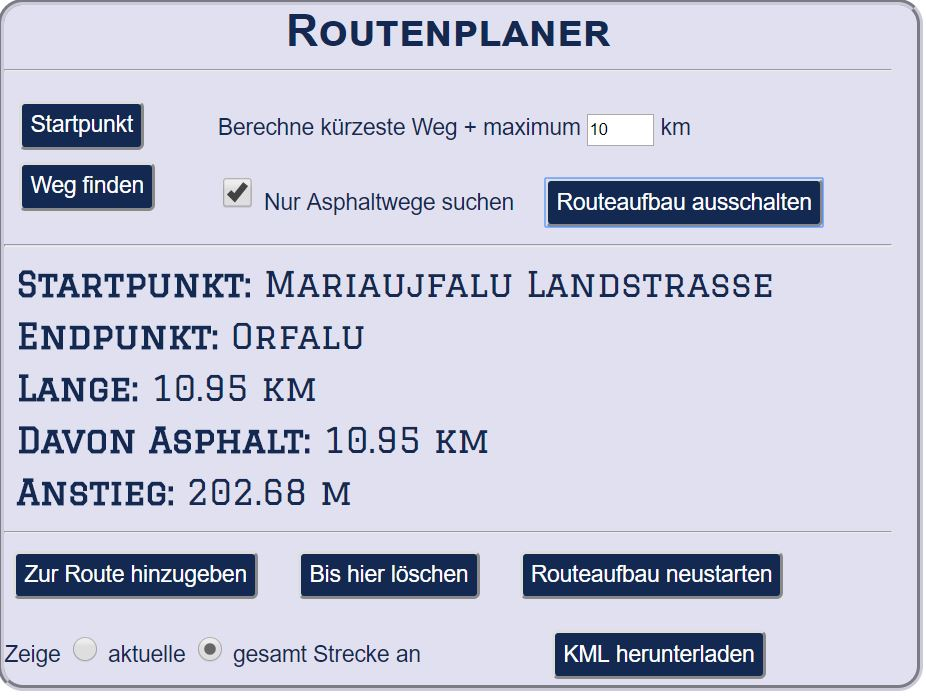

# LandOfTheGuardians-2.0
Route planner for bikers, same as LandOfTheGuardians but converted to a Java Web project in order to add Java servlets. 

# LandOfTheGuardians
A website to improve cycling experience in the Orseg, a region of Hungary, including a flexible route planner with GoogleMaps and elevation chart.
 

 
The project has been conceived and started as an exam project and will be fully functional by the 4th May 2018. Later it is planned to function as a real website, available in German, Hungarian and maybe English. 
Orseg is a region in Hungary near to the city of Szentgotthard. Since it is close to the Austrian and Slovenian borders, people who once inhabited this area were responsible for protecting the border, for which they enjoyed a special status (that's why the name of the project is "Land of the Guardians").
Due to the scenic landscape with lots of forests, the mildly steep hills and the presence of both concrete and forest roads with only light or no traffic, the region is perfect for cycling. However, the scarce availability of online information may hold back some tourists to visit the area. 
 
<h2> Goal 1: Give information for tourists, with a focus on cyclers </h2>
Sights that are worth to visit will be presented as placemarkers on a GoogleMaps map, with further information, images and links. An image gallery will further raise the attention of future tourists. Beside these, the site will include practical information about reaching the area, finding accomodation, a list of shops, doctors and bike repair possibilities, important traffic and border crossing rules, etc.
 
<h2> Goal 2: Give route information </h2>
After exploring the sights on a GoogleMaps map, visitors of the site will be able to choose places and check all bikeable routes between them. Each possible route will appear on the map, the length of the route and the total elevation will be shown on a control panel, and a chart will show the elevation profile. 
 

 
<h2> Goal 3: Build & carry your own bike tour route </h2>
The former route finder function will offer adding a selected section to a route, therefore users can build their own cycle tour of any length. Should one plan a lazy sightseeing round or a hard workout, the site is optimal for both. Once the route is built, it can be downloaded as a .kml file, which can be imported into GoogleMaps or any other navigation software. Therefore users can take their own route plans with themselves on their GPS or smartphone to get on-site navigation. 

